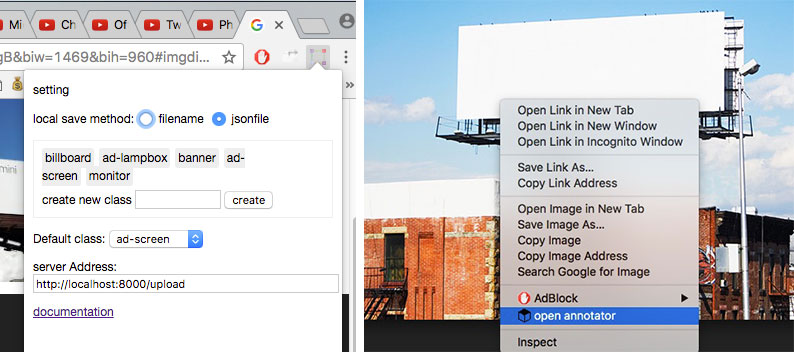
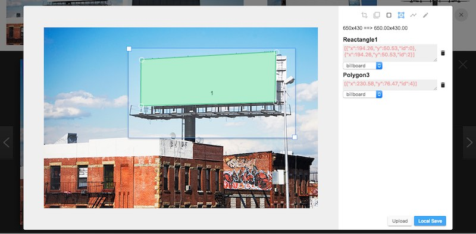

DL_Annotator
========
!!! WIP

### TODO
 - scale and crop using canvas
 - more annotation type for: paint tool, pen tool for bezier curve contour
 - ui for mannually set parent child relationship
 - ~~keyboard shortcuts for save and other actions~~
 - highlight images on webpage
 - screen capture

## install
drag the packed "./app.crx" to chrome extension page to install, then click the extension icon on the top right hand side to configure it.

## scripts
inside scripts folder there are some hlepful python script to perform datacheck and resizing, before you run them, make sure you take look at what it imports, you might need to install its required package like *opencv* or *pillow*
 - *datachecker.py* deduplication, annotation validation and resize down to 500px
 - *display.py* render image and its annotation, with simple drag to crop functionality(opencv3 required)
 - *yolo_darknet.py* generate YOLO trainging image and .txt labels

